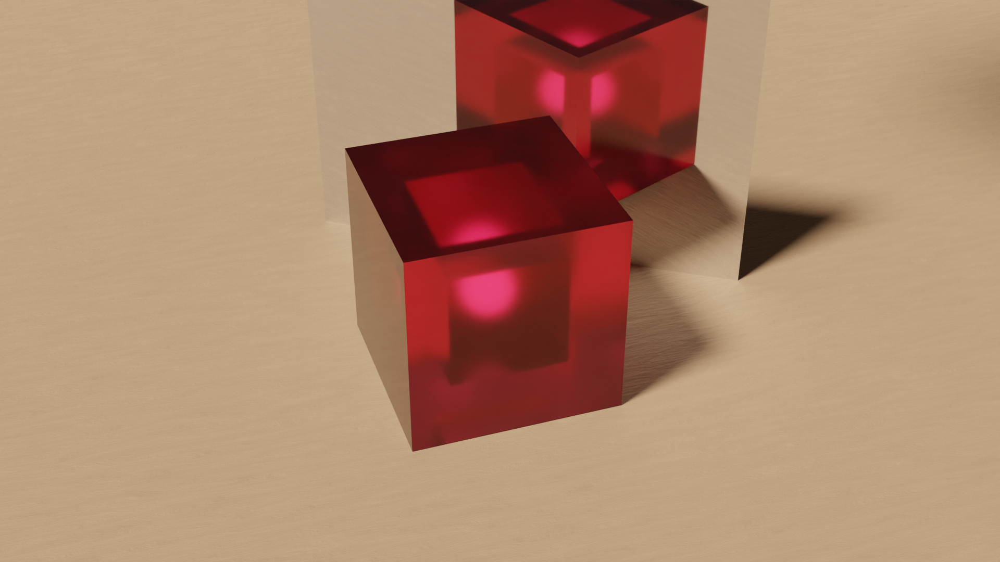

# Approche historique du théorème d'Euler sur les polyèdres

**En cours d'écriture, de nombreuses erreurs subsistent**

**En cours d'écriture, de nombreuses erreurs subsistent**

**En cours d'écriture, de nombreuses erreurs subsistent**

## Introduction

### *Les polyèdres*

> Figure 1 : Polyèdres réguliers et semi-réguliers

Peut on trouver une relation entre le nombre de face d'un polyèdre, son nombre de sommet et son nombre d'arête? 
La difficulté essentielle de cette simple question tient à la définition même du terme polyhèdre. 
Dans son essai philosophique Preuves et réfutations, Imre lakatos questionne les influences mutuelles des définitions et des démonstrations en s'appuyant sur des éléments historiques. Notre approche se veut connexe à celle de Lakatos : remonter aux textes sources et analyser mathématiquement les démonstrations que l'on y trouve. Notre objectif premier est d'étudier les relations entre les méthodes mathématiques mises en oeuvre dans ces textes de façon à donner àvoir certains des processus pouvant conduire à l'ouverture de nouveaux champs de recherche mathématique.

### Qu'est-ce qu'un polyèdre : une véritable question !

Sur la [figure 1](#fig1), on peut observer deux types de solides dont le statut de polyèdre a toujours fait consensus : 

1. les solides de Platon : ce sont les 5 polyèdres convexes réguliers, c'est-à-dire dont toutes les faces sont des polygones réguliers convexes identiques et tel que chaque sommet est entouré du même nombre de faces ;
2. Des solides d'Archimède : ce sont des polyèdres convexes semi-réguliers, c'est-à-dire que plusieurs sortes de polygones réguliers coéxistent sur le solide (au moins 2) se rencontrant à des sommets identiques.

Cependant, tous les solides ne sont pas des polyèdres. Il devrait vous suffire de confronter votre intuition de ce qu'est un polyèdre aux formes représentées sur la [figure 2](#fig2) pour entrevoir la difficulté d'en expliciter une définition ou de les classifier : en effet certaines de ces formes sont des polyèdres, d'autres n'en sont pas et d'autres encore en ont été ou auraient pu en être...
C'est par l'étude historique et mathématique des preuves de conjectures connexes au théorème d'Euler que nous nous allons préciser les termes de la discussion autour de la définition de polyèdre.

> Figure 2 : Solides et surfaces polyèdrales hétérodoxes

### *Le théorème d'Euler*

C'est en 1750 qu'Euler, dans une lettre à Golbach [^goldbach], énonce le théorème qui porte son nom [^descartes_pont]. Euler souligne son importance parmi une série de conjectures sur les polyèdres.

Citons l'énonciation du théorème par Euler :

Dans tout solide fermé par des faces planes, la somme du nombre de faces $H$ et du nombre d'angles solides[^sommet] $S$ dépasse de deux unités le nombre d'arêtes $A$. [^goldbach]

$$H+S=A+2$$

Vérifions cette équation sur certains exemples de la [figure 1](#fig1) [^marchepas]. 

| Polyèdre                | Nb de Sommet | Nb d'Arête | Nb de Face | S-A+H |
| ----------------------- | ------------ | ---------- | ---------- | ----- |
| Octaèdre                | 6            | 12         | 8          | 2     |
| Dodécaèdre              | 20           | 30         | 12         | 2     |
| Cuboctaèdre             | 12           | 24         | 14         | 2     |
| Icosidodécaèdre tronqué | 120          | 180        | 62         | 2     |

> Figure 3 : Icosidodécaèdre tronqué

Dans cette lettre, Euler introduit le terme d'arête, ce nouveau concept modifie la réflexion autour des polyèdres. On peut alors se demander, avec J.C. Pont [^pont], si ce n'est pas le concept qui manquait à Descartes pour découvrir cette relation. 

Euler donnera une preuve de ce théorème dans un mémoire publié 8 ans plus tard [^eulerdemo]. Pour l'analyse détaillée de cette preuve, nous renvoyons à l'ouvrage de J.C Pont ([^pont] p.18). Ce sont en effet sur les approches de plusieurs mathématiciens francophones, proches successeurs d'Euler, que nous allons maintenant porter notre attention. En particulier, nous allons analyser les tentatives de Legendre, Poinsot, L'Huilier et Cauchy visant à circonscrire le domaine de validité du théorème. 

## La preuve de Legendre par projection sur une sphère

En 1794, Legendre publie ses Éléments de géométrie[^legendre]. Cet ouvrage, en plusieurs tomes, se veux une actualisation et une simplification des Éléments d'Euclide [^hon_goldstein]. Comme le remarque Lebesgue, la preuve du théorème d'Euler n'y est pas centrale :

> Legendre ne s'est jamais proposé de démontrer le théorème d'Euler, mais ayant bâti à une occasion quelconque des considérations voisines de celles qui figurent dans sa démonstration, il s'est aperçu qu'il avait les éléments nécessaires à cette démonstration. [^lebesgue1]

C'est dans le chapitre sur la géométrie sur la sphère que la démonstration prend place. L'astuce est de projeter le polyèdre sur une sphère pour utiliser les théorèmes développés précédement par Legendre. Une retranscription de la preuve est disponible en vidéo ci-dessous.

Quelques définitions, fournies par Legendre, sont cependant nécessaires pour appréhender cette preuve :

1. On appelle *grand cercle* la section de la sphère faite par un plan passant par son centre. Ce plan coupe la sphère en deux surfaces égales.
2. On appelle *Fuseau* la partie de la surface de la sphère comprise entre deux demi-grands cercle qui se terminent à un diamètre commun.
3. On appelle *Triangle sphérique* une partie de la surface de la sphère délimitée par trois arcs de grands cercles. Ces arcs, qui sont les côtés du triangle, sont toujours supposés plus petits que la demi-circonférence.

L'unité d'angle est l'angle droit et l'unité de surface est le triangle tri-rectangle sur la sphere (1/8 ème de la sphère).

<video width="100%" controls>
    <source src="../media/legendre.mp4" type="video/mp4">
</video>

> Vidéo 1 : Preuve de Legendre du théorème d'Euler pour les polyèdres convexes

Commençons par une remarque concernant l'utilisation que fait Legendre des unités. En effet, de façon a priori étonnante, de constater que certaines des équations de Legendre établissent une égalité entre des angles et des aires. Par exemple $aire(ABC)=\sum_{i=1}^{3}\tau_i-2$ avec $\tau_i$ l'angle i du triangle ABC. On peut faire sens de cette équation en se ramenant à l'égalité entre proportion sur le fuseau d'une sphère :

$$\frac{aire(Fuseau)}{aire(Sphere)}=\frac{angle(Fuseau)}{4\ angles\ droits} \Leftrightarrow \frac{aire(Fuseau)}{8}=\frac{angle(Fuseau)}{4} \Leftrightarrow \frac{aire(Fuseau)}{2}=angle(Fuseau)$$

On peut alors comprendre un angle comme une aire.

Revenons à la démonstration produite par Legendre.

Dans le chapitre qui précéde celui sur la sphère, voici la définition que Legendre nous donne :

> On appelle *solide polyèdre*, ou simplement *polyèdre*, tout solide terminé par des plans ou des faces planes. (Ces plans sont nécessairement terminés eux-mêmes par des lignes droites.) 

Puis, à propos des arêtes :

> L'intersection commune de deux faces adjacentes d'un polyèdre s'appelle côté ou *arête* du polyèdre.

Puis en bas de page, il y a cette note très importante :

> N. B. Tous les polyèdres que nous considérons sont des polyèdres à angles saillants ou polyèdres convexes. Nous appelons ainsi ceux dont la surface ne peut être rencontrée par une ligne droite en plus de deux points. Dans ces sortes de polyèdres le plan prolongé d'une face ne peut couper le solide ; il est donc impossible que le polyèdre soit en partie au-dessus du plan d'une face, en partie au-dessous; il est tout entier d'un même côté de ce plan.

Legendre se replie sur le terrain sûr des polyèdres convexes, il ne souhaite donc pas prouver la conjecture d'Euler dans toute sa généralité (sur tout polyèdre). Il évite ainsi les questions difficiles de la conjecture, qui est la classification des solides non convexes.

En effet, comme le remarque Poinsot dès 1810, la preuve de Legendre peut s'appliquer à une classe plus grande de polyèdres :

> Je ferai d'abord observer que l'équation précédente n'a pas seulement lieu pour les solides convexes ordinaires, c'est-à-dire, pour ceux dont la surface ne peut être coupée par une droite en plus de deux points elle subsiste encore pour tout polyèdre qui a des angles solides rentrans pourvu qu'on puisse trouver, dans l'intérieur du solide un point qui soit le centre d'une sphère telle que les faces du solide y étant projetées par des lignes menées au centre, il n'y ait sur la sphère aucune duplicature de ces projections je veux dire, pourvu qu'aucune face ne se projette, en tout ou en partie, sur la projection d'une autre ; ce qui convient, comme on voit, à une infinité de polyèdres à angles solides rentrans. [^poinsot]

C'est d'ailleurs aux recherches de Poinsot que nous allons maintenant nous intéresser car celui-ci a justement développé sa classification des polyèdres sur la technique de démonstration de Legendre. En applicant sa méthode, Poinsot va ainsi (re)découvrir les polyèdres étoilés qui fourniront un carburant essentiel au dépassement d'une perception restreinte de la notion de polyèdre.

## Les polyèdres étoilés de Poinsot

C'est dans le journal de l'école polytechnique de 1810 [^poinsot] que Poinsot présente sa réflexion sur la question des polyèdres. Dans son introduction il place sa réflexion dans un champs de recherche bien précis des mathématiques qui est celui de la géométrie de situation :

> On rapporte les questions suivantes à la géométrie de situation parce qu'on y considère moins la grandeur et la proportion des figures, que l'ordre et la situation des divers élémens qui les composent.

Avant de traiter la classification des polyèdres, Poinsot va traiter la classification des polygones, une question plus simple, amenant de bonnes idées dans le traitement des polyèdres, en particuliers la questions des polygones étoilés. Combien existe-t-il de polygones réguliers à 7 côtés, il distingue la première espèce, l'heptagone, des espèces supérieures (étoilées), les heptagrammes. La notion d'espèce supérieure correspond au fait que pour tracer un n-polygone de h-ième espèce, les points sont joints de h en h, et finalement le périmètre fait h fois le tour de l'espace angulaire. Pour que la h-ième espèce soit considérée il faut fermer le n-polygone en une seule ligne et qu'il ne soit pas similaire à un n-polygone d'espèce inférieure. Dans le cas de l'heptagone, il y a 3 espèces :

<video width="100%" controls>
    <source src="../media/RP.mp4" type="video/mp4">
</video>

> Vidéo 2 : Espèces d'heptagone

Ces considérations sur les polygones étoilés, pourraient expliquer ce qui amène Poinsot à se demander s'il est possible d'appliquer des polygones d'espèces supérieures comme faces des polyèdres voire, encore plus surprenant, si les faces ne pourraient pas se rencontrer sous cette forme lorsqu'on effectue une coupe au voisinage d'un sommet ou au centre.

<video width="100%" controls>
    <source src="../media/espece.mp4" type="video/mp4">
</video>

> Vidéo 3 : Espèce des sommets d'un polyèdre et espèce du polyèdre

En partant de ces considérations et de la preuve de Legendre, Poinsot va en généraliser le principe :

1. Legendre supposait (à raison pour les polyèdres convexes) que lors de la projection les faces du polyèdre recouvraient une seule fois la sphère circonscrite. Poinsot dans le cas de ses polyèdres étoilés remarque que la sphère peut être recouverte plusieurs fois. Le nombre de recouvrement de la sphère (E) est égale à l'espèce du polygone (ou la somme des espèces des polygones) relevant d'une section plane passant par le centre du polyèdre.

2. Autour de chaque sommet, la somme des angles réunis vaut $e$ fois 4 angles droits, $e$ correspond à l'espèce des angles solides.

Il obtient alors :

$$e.S-A+H=E.2$$

En fixant des valeurs des paramètres $e$ et $E$, puis en cherchant des solutions de l'équation correspondante, il va ainsi trouver 4 polyèdres réguliers étoilés. Avec les solides de Platon se sont les seules solutions régulières de l'équation.

| Polyèdres Étoilés de Kepler-Poinsot | e    | E    |
| ----------------------------------- | ---- | ---- |
| Petit dodécaèdre étoilé             | 1    | 3    |
| Grand dodécaèdre étoilé             | 1    | 7    |
| Grand dodécaèdre                    | 2    | 3    |
| Grand icosaèdre                     | 2    | 7    |

> Figure 4 : Les polyèdres de Kepler-Poinsot

On les nomme Polyèdres Étoilés de Kepler-Poinsot dû au travail de Kepler qui 2 siècles auparavant avait déjà décrit le petit et grand dodécaèdre étoilé [^kepler]. Poinsot ne fait aucune mention de Kepler, il se pourrait donc qu'il n'en avait pas connaissance.

Le fait décisif à nos yeux tient à ce que deux de ces polyèdres sont des contre-exemples à la conjecture d'Euler. En effet, pour le Petit Dodécaèdre Étoilé et le Grand Dodécaèdre on a $S-A+F=-6$. On ne peut que remarquer que Poinsot n'en fait pas le constat dans son article. Il n'use pas non plus de ce que Lakatos appelle "la relégation de monstres", c'est à dire que Poinsot n'essaye pas d'exclure ces nouveaux objects de la définition des polyèdres pour conserver la validité du théorème d'Euler. Bien au contraire, il passe par la légitimité des polygones d'espèces supérieures pour légitimer les polyèdres étoilés. 

Un an plus tard, L'Huilier va continuer à son tour exhiber des contre-exemples, mais cette fois il les identifiera comme tels.

## L'Huilier une classification des contres exemples

Les travaux de L'Huilier dont nous avons connaissance sur le théorème d'Euler sont publiés en 1811 dans les Memoires de l'Academie Imperiale de Saint Petersbourg [^huilier1]. Il est aussi intéressant d'inclure dans cette étude le commentaire de ce mémoire par Gergonne dans les Annales de Mathématiques en 1813 [^huilier2].

Deux parties structurent la publication de L'Huilier, une démonstration du théorème d'Euler dans le cas des polyèdres convexes puis une classification des exceptions à ce théorème.

Nous n'allons pas commenter la première partie dans laquelle il expose sa démonstration. Retenons juste qu'elle se base sur l'idée suivante : la décomposition d'un polyèdre en pyramides à partir d'un point quelconque de son intérieur en prenant les faces du polyèdre comme bases. Il faut alors montrer que dans le cas d'une pyramide on a bien $S-A+F=2$ et que les différents modes de recollement des pyramides n'affectent en rien l'équation obtenue.

Nous allons nous interesser à la seconde partie de cet article, issue de la réflexion de L'Huilier sur sa démonstration du théorème d'Euler. Ceci fera d'ailleurs dire à Lebesgue :

> Pourtant Euler ne comprit pas le véritable intérêt de sa proposition, lequel ne pouvait être mis en évidence que par celui qui, au lieu de démontrer la formule d'Euler, montrerait qu'elle n'est pas toujours vraie comme devait le faire L'Huilier en 1813. [^lebesgue2]

Trois types d'exceptions sont introduits, qui, il nous semble, sont plutôt au nombre de quatre. 

1. La première exception est la face annulaire ou couronne polygonale, c'est une face qui est comprise entre deux polygones. L'ajout d'une arête (voir [fig.5](#fig5)) ne modifie pas le nombre de face ni le nombre de sommet et vient donc changer la valeur de $S-A+F$. Si n est le nombre de face annulaire du polyèdre, on a $S-A+F=2+n$.

> Figure 5 : Exemple de face annulaire et non annulaire

2. Ensuite L'Huilier se propose de pouvoir diminuer le résultat de $S-A+F$ en joignant deux sommets pour n'en former qu'un, sans modifier le nombre de faces ou d'arêtes. Gergonne ne reviendra pas sur cette partie de l'article. [fig.6](#fig6)

> Figure 6 : Exemple de solide pour lequel $S-A+F=1$

3. La troisième exception survient quand un polyèdre est traversé de part en part. Pour chaque trou dans le polyèdre la somme $S-A+F$ est alors diminuée de deux unités ([fig.7](#fig7)). Soit n le nombre de trou distinct, on a ainsi $S-A+F=2(1-n)$. Cette équation est très intéressante, et peut faire penser à de nombreux égards au concept de genre en topologie bien que, ici, il soit encore défini de manière primaire et ne permette pas de classifier des polyèdres comme dans la [figure 8](#fig8).

> Figure 7 : Polyèdre à un trou et polyèdre à 3 trous

> Figure 8 : Exemple de polyèdre non décrit par le modèle de L'Huilier

4. La dernière exception concerne les polyèdres contenant une cavité. Les résultats des équations $S-A+F=2$ pour les deux surfaces du polyèdre s'additionnent. On a alors $S-A+F=4$. Soit n le nombre de cavité d'un polyèdre, on a alors $S-A+F=2(n+1)$. ([fig.9](#fig9))

> Figure 9 : Polyèdre cubique avec une cavité cubique

Il est difficile de considérer l'entièreté de ces exceptions comme des monstruosités qui n'appartiennent pas au groupe des polyèdres. On peut donc chercher à quel sous ensemble s'applique le théorème d'Euler, mais de façon tout aussi intéressante et c'est ce qui semble se dessiner ici, on peut classifier les différents types de polyèdres en fonction du résultat de $S-A+F$ et chercher quelles sont les propriétés qui différencient ces classes.

L'Huilier et Gergonne permettent en un sens de sortir de la conjecture rigide d'Euler pour les polyèdres, et faire un pas vers ce qui deviendra une propriété topologique des polyèdres : la caractéristique d'Euler. 

La même année (1813), un grand mathématicien va pourtant prouver que tous les polyèdres sont Eulerien ($S-A+F=2$).

## Cauchy projette sur le plan les polyèdres

La structure de l'article où Cauchy [^cauchy] présente sa preuve est assez paradoxale : dans une première partie il étudie les questions laissées en suspens par Poinsot dans son étude des polyèdres étoilés, puis il passe à la démonstration du théorème d'Euler pour tout polyèdre alors même que sa première partie contenait des contre-exemples. Cette démonstration ambitieuse bien qu'erronée s'avère toutefois très importante pour le dépassement du cadre des polyèdres. En effet, alors que les preuves précédentes se repliaient sur le cas des polyèdres convexes et empéchaient une réflexion plus globale, Cauchy s'attaque au problème général.

On peut voir ci dessous la preuve de Cauchy (un peu simplifiée). 

<video width="100%" controls>
    <source src="../media/cauchy.mp4" type="video/mp4">
</video>

> Vidéo 4 : Preuve de Cauchy du théorème d'Euler sur les polyèdres

Bien sûr, les contre-exemples globaux que nous avons vus nous informent sur la fausseté de certaines assomptions de Cauchy. En particulier il suppose que tous les polyèdres peuvent être mis sous forme de graphes dans le plan. Or cette hypothèse est fausse dans de nombreux cas : par exemple dans le cas d'un polyèdre traversé de part en part (3ème exception de L'Huilier), si l'on enlève une face alors il est impossible de mettre le reste du polyèdre dans le plan sans croiser des arêtes.

Toutefois, cette preuve peut facilement être amendée en explicitant une assomption cachée chez Cauchy qui ne regarde que les polyèdres transformables en graphes planaires. On obtient alors un théorème valide : "Tous les polyèdres transformables en graphes planaires sont Euleriens". On a ainsi réussi à montrer le théorème d'Euler sur un ensemble plus grand que celui des seuls polyèdres convexes. 

Selon Lakatos cette "analyse critique de la preuve" constitue un passage essentiel du développement de nouvelles mathématiques. Plus encore, comme la vidéo de la [preuve](#cauchy) le suggère, les idées mises en oeuvre par Cauchy dans sa preuve s'avèrent très fécondes. En effet, elles conduisent à préciser des définitions (polyèdre), elles contiennent en germes de nouveaux concepts (graphe planaire) et ouvrent de nouveaux champs de recherche (théorie des graphes). 

<video width="100%" controls>
    <source src="../media/cauchy2.mp4" type="video/mp4">
</video>

> Vidéo 5 : Exemple de polyèdre non convexe qui fonctionne dans la preuve de Cauchy

## Conclusion

En 20 ans, de 1794 à 1814, la recherche sur les polyèdres fut principalement francophone. Nous avons étudié ici les travaux de Legendre, Poinsot, L'Huilier et Cauchy en prêtant une attention particulière aux contre-exemples qu'ils ont exhibés, aux hypothèses complémentaires qu'ils ont formulées ainsi qu'aux preuves qu'ils ont produites. Dans ces travaux, deux directions principales se distinguent : l'une tend à restreindre le champ de validité de la proposition d'Euler, l'autre tend à élargir le champ des concepts et des techniques mobilisables. Par exemple la preuve de Cauchy fait un lien entre les polyèdres et la théorie des graphes. L'exploitation de ce lien par Van Staudt le conduira, en 1847, à énoncer (et à prouver) un théorème qui est peut-être vu comme la conclusion du problème soulevé par Euler un siècle plus tôt :

> Si chaque sommet d'un polyhèdre peut être relié à chaque autre sommet par une arête ou par une ligne composée d'arêtes, et si sa surface est divisée en deux parties par toute ligne fermée composée d'arêtes qui ne passe pas plus d'une fois par un même point, alors le nombre E des sommets plus le nombre F des faces est égal au nombre K d'arêtes plus deux. [^vonstaudt]

N'hésitez pas à prendre le temps d'observer comment Von Staudt, avec ce théorème, exclu tous les contre-exemples vus précédement.

Cependant, les recherches ont rapidement dépassé le cadre de la question initiale d'Euler. On peut retrouver maintes fois l'apparition de l'équation d'Euler ou caractéristique d'Euler dans le développement de la topologie[^pont], on pourra cité son utilisation dans l'étude et la classification des surfaces (au moyen de la triangularisation) et aboutissant à l'homologie avec le travail de Poincaré. C'est d'ailleurs Poincaré qui donnera une proposition d'axiomatisation de la notion de polyèdre[^lakatos] [^poincare], faisant reculer les difficultés de s'accorder sur une définition de polyèdre. 

Finalement, ce morceau de fresque historique se développant autour de la conjecture d'Euler-Descartes rend palpable les tatonements de la science mathématique, à coup d'erreurs, de théorèmes erronés, d'exemples extravagants, la science avance.

## References

***Pour aller plus loin***

David S. Richeson, Eulers gem - the polyhedron formula and the birth of topology (2008)

Norman L. Biggs, E. Keith Lloyd, R. J. Wilson - Graph Theory 1736-1936 

Peter R. Cromwell - Polyhedra (1999)

Imre Lakatos - Preuves et Réfutations essai sur la logique de la découverte mathématique

Jean-Claude Pont - La topologie algébrique des origines à Poincaré

***Notes de bas de page***

[^lakatos]: Imre Lakatos, Preuves et Réfutations

[^goldbach]: L. Euler, Letter to Christian Goldbachl, Berlin. November 1750

[^descartes_pont]: Certains historiens condidèrent que Descartes était passé de peu à côté, voir Jean-Claude Pont, La topologie algébrique des origines à Poincaré p.6.

[^pont]: Jean-Claude Pont, La topologie algébrique des origines à Poincaré

[^sommet]: Un angle solide est ici un synonyme de sommet.

[^marchepas]: Nous laissons le soin au lecteur de tester la validité de la formule d'Euler sur les exemples de la [figure 2](#fig2).

[^eulerdemo]: L. Euler, Demonstratio Nonnularum Insignium Proprietatum Quibus Solida Hedris Planis Inclusa Sunt Praedita, Novi Commentarii Academiae Scientiarum Petropolitanae 4 (1752/53), 1758, p.140-160

[^legendre]: A. M. Legendre, Elements de Geometrie, 1794

[^hon_goldstein]: G. Hon, B. R. Goldstein, Legendre's Revolution (1794): The Definition of Symmetry in Solid Geometry, p. 113

[^lebesgue1]: H. Lebesgue, Remarques sur les deux premières démonstrations du théorème d'Euler, relatif aux polyèdres, Bulletin de la Société mathéma-
tique de France, t. 52, Paris, 1920, p. 315.336.

[^poinsot]: L. Poinsot, Mémoire sur les Polygones et les Polyèdres, J. École Polytechnique 10 (1810) p.16-48

[^kepler]: J. Kepler, Harmonices Mundi, 1619, p. 58

[^huilier1]: S. A. J. L'Huilier, Démonstration Immédiate d'un Théoreme Fondamental d'Euler sur les Polyèdres et Exceptions dont ce Theoreme est Susceptible, Memoires de l'Academie Imperiale de Saint Petersbourg 4, 1811, p.271-301

[^huilier2]: S. A. J. L'Huilier et J. D. Gergonne, Mémoire sur la Polyèdrométrie, Annales de Math., Pures et Appliquees 3, 1812/13, p.168-191

[^lebesgue2]: H. Lebesgue, Cahiers de Lebesgue (voir aussi [^pont] p.19)

[^cauchy]: A. L. Cauchy, Recherches sur les Polyedres , J. École Polytechnique 9, 1813, p.68-86^

[^vonstaudt]: K. G. C. Von Staudt, Geometrie der Lage, Niirnberg, 1847 (voir la traduction par Nabonnand)

[^poincare]: H. Poincaré, Analysis situs, Journal de l'École Polytechnique (1), pp. 1-121, et Œuvres 1. VI, pp. 193-288. Paris: Gauthier-Villars, 1953

[^poincare2]: https://analysis-situs.math.cnrs.fr/Commentaires-de-la-note-Sur-la-generalisation-d-un-theoreme-d-Euler-relatif-aux-polyedres.html
