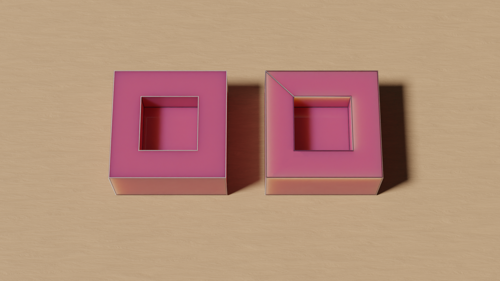

# Approche historique du théorème d'Euler sur les polyèdres

**En cours d'écriture, de nombreuses erreurs subsistent**

**En cours d'écriture, de nombreuses erreurs subsistent**

**En cours d'écriture, de nombreuses erreurs subsistent**

## Introduction

### *Les polyèdres*

> Figure 1 : Polyèdres réguliers et semi-réguliers

Le concept de polyèdre pour les mathématiciens du 18ème siècle était vaguement défini et reposait surtout sur une intuition forte de ces solides. Sur la [figure 1](#fig1), on peut observer des polyèdres qui font concensus, les solides de Platon qui sont des polyèdres réguliers et des solides d'Archimède. Quels sont leurs propriétés communes qui pourrait nous donner une première définition de polyèdre. Naïvement, ce sont des solides à face plane et c'est ainsi qu'il sont considéré par **de nombreux mathématiens** [Qui ?] sans remarquer les postulats sous-jacent. Il faut commencer quelque part et c'est avec cette définition que nous commencerons, elle se montrera insuffisante et on peut déjà la mettre en conflit face à des exemples que nous rencontrerons durant ce périple. [bof ce paragraphe, inutile de donner une définition pour l'instant ? Ou en donner plusieurs ?]

> Figure 2 : Solides et surfaces polyèdrales hétérodoxes

C'est justement le travail de preuve des conjectures, en particuliers du théorème d'Euler, qui va venir consolider ce champs de recherche et mettre au grand jour les difficultés à saisir le sens de polyèdre [^lakatos]. Et de cette question toute simple, peut on trouver une relation entre le nombre de face d'un polyèdre, son nombre de sommet et son nombre d'arête.

### *Le théorème d'Euler*

C'est en 1750 qu'Euler, dans une lettre à Golbach [^golbach], énonce le théorème qui porte son nom. Descartes était passé de peu à côté (voir p.6 [^pont]), Euler pointe son importance parmis une série de conjecture sur les polyèdres.

Pour tout polyèdre, son nombre de face $H$ auquelle on ajoute ses angles solides $S$ [^sommet] est égale à son nombre d'arête $A$ plus deux.

$$H+S=A+2$$

Vérifions cette équation sur certains exemples, et peut être souhaitez vous en chercher des contre-exemples.

| Polyèdre                | Nb de Sommet | Nb d'Arête | Nb de Face | S-A+H |
| ----------------------- | ------------ | ---------- | ---------- | ----- |
| Octaèdre                | 6            | 12         | 8          | 2     |
| Dodécaèdre              | 20           | 30         | 12         | 2     |
| Cuboctaèdre             | 12           | 24         | 14         | 2     |
| Icosidodécaèdre tronqué | 120          | 180        | 62         | 2     |

> Figure 3 : Icosidodécaèdre tronqué

Dans cette lettre, Euler introduit le terme d'arête, ce nouveau concept modifie la réflexion autour des polyèdres. On peut alors se demander si ce n'est pas le concept qui manquait pour découvrir cette relation. 

Euler en donnera une preuve 8 ans plus tard, Legendre, L'Huilier et Cauchy suivront peu après. Nous n'allons pas étudier sa preuve disponible dans son mémoire [^eulerdemo], une critique en est faite par J.C Pont p.18 [^pont].

C'est les répercutions de ce théorème sur les mathématiciens francophones que nous allons analyser, comment les nombreuses preuves à paraître vont venir enrichir le débat, tout autant que des contres exemples. 

## La preuve de Legendre par projection sur une sphère

En 1794, Legendre sort ses Éléments de géométrie [^legendre], ces ouvrages se veulent une actualisation et une simplification des éléments d'Euclide. La preuve du théorème d'Euler n'y est pas centrale et semble être un petit détour que Legendre prend. Citons Lebesgue à propos de cette preuve :

> Legendre ne s'est jamais proposé de démontrer le théorème d'Euler, mais ayant bâti à une occasion quelconque des considérations voisines de celles qui figurent dans sa démonstration, il s'est aperçu qu'il avait les éléments nécessaires à cette démonstration. 

C'est dans son chapitre sur la géométrie sur la sphère que la démonstration prend place, l'astuce est de projeter le polyèdre sur une sphère pour utiliser les théorèmes développés précédement par Legendre. Une retranscription de la preuve est disponible en vidéo ci-dessous.

Quelques définitions sont nécessaire pour appréhender la preuve :

1. On appelle *grand cercle* la section de la sphère faite par un plan passant par sont centre. Ce plan coupe en deux surfaces égales la sphère.
2. *Fuseau* est la partie de la surface de la sphère comprise entre deux demi-grands cercle qui se terminent à un diamètre commun.
3. *Triangle sphérique* est une partie de la surface de la sphère comprise par trois arcs de grands cercles. Ces arcs, qui sont les côtés du triangle, sont toujours supposés plus petits que la demi-circonférence.

L'unité d'angle est l'angle droit et l'untité de surface est le triangle tri-rectangle sur la sphere (1/8 ème de la sphère).

<video width="100%" controls>
    <source src="../media/legendre.mp4" type="video/mp4">
</video>

> Vidéo 1 : Preuve de Legendre du théorème d'Euler pour les polyèdres convexes

Dans le chapitre sur les polyèdres précédent celui sur la sphère, Legendre nous donne sa définition des polyèdres :

> On appelle *solide polyèdre*, ou simplement *polyèdre*, tout solide terminé par des plans ou des faces planes. (Ces plans sont nécessairement terminés eux-mêmes par des lignes droites.) 

À propos des arêtes :

> L'intersection commune de deux faces adjacentes d'un polyèdre s'appelle côté ou arête du polyèdre

Puis en bas de page, il y a cette note très importante :

> N. B. Tous les polyèdres que nous considérons sont des polyèdres à angles saillants ou polyèdres convexes. Nous appelons ainsi ceux dont la surface ne peut être rencontrée par une ligne droite en plus de deux points. Dans ces sortes de polyèdres le plan prolongé d'une face ne peut couper le solide ; il est donc impossible que le polyèdre soit en partie au-dessus du plan d'une face, en partie au-dessous; il est tout entier d'un même côté de ce plan.

Legendre se replie sur le terrain sûr des polyèdres convexes, il ne souhaite donc pas prouver la conjecture d'Euler dans toute sa généralité (sur tout polyèdre). Il évite ainsi les questions difficiles de la conjecture, qui est la classification des solides non convexes.

Poinsot en 1810 remarquera que la preuve de Legendre peut s'appliquer à une classe plus grande de polyèdres :

> Je ferai d'abord observer que l'équation précédente n'a pas seulement lieu pour les solides convexes ordinaires, c'est-à-dire, pour ceux dont la surface ne peut être coupée par une droite en plus de deux points elle subsiste encore pour tout polyèdre qui a des angles solides rentrans pourvu qu'on puisse trouver, dans l'intérieur du solide un point qui soit le centre d'une sphère telle que les faces du solide y étant projetées par des lignes menées au centre, il n'y ait sur la sphère aucune duplicature de ces projections je veux dire, pourvu qu'aucune face ne se projette, en tout ou en partie, sur la projection d'une autre ; ce qui convient, comme on voit, à une infinité de polyèdres à angles solides rentrans. [^poinsot]

On peut aussi noté que c'est une preuve géométrique qui ne s'écarte pas des concepts métriques contrairement à ce qu'avait essayé Euler et c'est aussi dans ce sens qu'ira la preuve de Cauchy. On remarque alors sont utilisation des unités et il peut être étonnant de que certaines de ses équations sont une égalité entre des angles et des aires. par exemple $aire(ABC)=\sum_{i=1}^{3}\tau_i-2$ avec $\tau_i$ l'angle i du triangle ABC. On peut faire sens cette équation en ce ramenant à l'égalité entre proportion sur le fuseau d'une sphère :

$$\frac{aire(Fuseau)}{aire(Sphere)}=\frac{angle(Fuseau)}{4\ angles\ droits} \Leftrightarrow \frac{aire(Fuseau)}{8}=\frac{angle(Fuseau)}{4} \Leftrightarrow \frac{aire(Fuseau)}{2}=angle(Fuseau)$$

On peut alors penser un angle comme une aire à l'aide cette égalité.

Le mathématicien suivant qui nous intéresse a justement développé sa classification des polyèdres sur la technique de démonstration de Legendre. En applicant sa méthode, Poinsot va aussi (re)découvrir des polyèdres étoilés qui seront un carburant pour une pensée plus globale de ce champs.

## Les polyèdres étoilés de Poinsot

C'est dans le journal de l'école polytechnique de 1810 [^poinsot] que Poinsot présente sa réflexion sur la question des polyèdre. Dans son introduction il place sa réflexion dans un champs de recherche bien précis des mathématiques qui est celui de la géométrie de situation :

> On rapporte les questions suivantes à la géométrie de situation parce qu'on y considère moins la grandeur et la proportion des figures, que l'ordre et la situation des divers élémens qui les composent.

Avant de traiter la classification des polyèdres, Poinsot va traiter la classification des polygones, une question plus simple, amenant de bonnes idées dans le traitement des polyèdres, en particuliers la questions des polygones étoilés. Combient existe il de polygones réguliers à 7 côtés, il distingue la première espèce, l'heptagone, des espèces supérieurs (étoilés), les heptagrammes. La notion d'espèce supérieur correspond au fait que pour tracer un n-polygone de h-ième espèce, les points sont joints de h en h, et finalement le périmètre fait h fois le tour de l'espace angulaire. Pour que la h-ième espèce soit considérée il faut fermer le n-polygone en une seule ligne et qu'il ne soit pas similaire à un n-polygone d'espèce inférieure. Dans le cas de l'heptagone, il y a 3 espèces :

<video width="100%" controls>
    <source src="../media/RP.mp4" type="video/mp4">
</video>

> Vidéo 2 : Espèces d'heptagone

Ces considérations sur les polygones étoilés, pourrait expliquer ce qui amène Poissot à se demander si il est possible d'appliquer des polygones d'espèces supérieurs comme faces des polyèdres mais encore plus surprenants, si les faces ne pourrait pas se rencontrer en un sommet sous cette forme. 

<video width="100%" controls>
    <source src="../media/espece.mp4" type="video/mp4">
</video>

> Vidéo 3 : Espèce des sommets d'un polyèdre et espèce du polyèdre

En partant de ces considération et de la preuve de Legendre, Poinsot va généraliser son utilisation :

1. Legendre supposait (à raison pour les polyèdres convexes) que lors de la projection les faces du polyèdre recouvrait une seule fois la sphère circonscrite. Poinsot dans le cas de ses polyèdres étoilés remarque que la sphère peut être recouverte plusieurs fois. Le nombre de recouvrement de la sphère (E) est égale à l'espèce du polygone (ou la somme des espèces des polygones) relevant d'une section plane passant par le centre du polyèdre.

2. Autour de chaque sommet, la somme des angles réunis vaut e fois 4 angles droits, e correspond à l'espèce des angles solides.

Il obtient alors :

$$e.S-A+H=E.2$$

En fixant des valeurs, puis en cherchant des solutions de l'équation il va trouver 4 polyèdres réguliers étoilés.

| Polyèdre Étoilé de Kepler-Poinsot | e   | E   |
| --------------------------------- | --- | --- |
| Petit dodécaèdre étoilé           | 1   | 3   |
| Grand dodécaèdre étoilé           | 1   | 7   |
| Grand dodécaèdre                  | 2   | 3   |
| Grand icosaèdre                   | 2   | 7   |

> Figure 4 : Les polyèdres de Kepler-Poinsot

Poinsot ne discutera pas du fait que deux de ces polyèdres sont des contre exemples à la conjecture d'Euler. Pour le Petit Dodécaèdre Étoilé et le Grand Dodécaèdre on a $S-A+F=-6$. Il n'use pas non plus de la relégation de monstres, c'est à dire qu'il n'essaye pas d'exclure ces nouveaux objects de la définition des polyèdres pour conserver la validité du théorème d'Euler. Bien au contraire, il passe par la légitimité des polygones d'espèces supérieurs pour légitimer les polyèdres étoilés. 

Ces polyèdres étoilées sont aussi appelés solides de Kepler-Poinsot car Kepler en décrivait déjà deux dans sont œuvre XXX en XXX. Poinsot semble les avoirs redécouvert   et ne fait aucune référence à Kepler.

Un an plus tard, L'Huilier va continuer à détérrer des contres examples, et qu'il identifira comme tels.

## L'Huilier une classification des contres exemples

Les travaux de L'Huilier dont nous avons connaissances sur le théorèmes d'Euler, sont au nombre de deux, une publication en 1811 dans les Memoires de l'Academie Imperiale de Saint Petersbourg, puis une réédition écourté et réinterprété par Gergonne dans les Annales de Mathématiques en 1813.

Deux parties structures ces articles, une démonstration du théorème d'Euler dans le cas des polyèdres convexes puis une catégorisation d'exceptions à ce théorème.

Nous n'allons pas développer sa démonstration, retenons juste qu'elle se base sur l'idée suivante : la décomposition d'un polyèdre en pyramides à partir d'un point quelconque de son intérieur et les faces du polyèdre comme base. Il faut alors montrer que dans le cas d'une pyramide on a bien $S-A+F=2$ et que les différents recollement des pyramides n'affectent en rien l'équation.

C'est la seconde partie qui nous intéresse, qui est en partie issue de la réflexion de l'huilier sur sa démonstration du théorème d'Euler et qui fera dire à Lebesgue :

> Pourtant Euler ne comprit pas le véritable intérêt de sa proposition, lequel ne pouvait être mis en évidence que par celui qui, au lieu de démontrer la formule d'Euler, montrerait qu'elle n'est pas toujours vraie comme devait le faire L'Huilier en 1813.

Trois types d'exceptions sont introduites, qui il nous semble sont plutôt au nombre de quatre. 

1. La première exception est la face annulaire ou couronne polygonale, c'est une face qui est comprise entre deux polygones. L'ajout d'une arête (voir fig.XXX) ne modifie pas le nombre de face ni le nombre de sommet et vient donc changer la valeur de $S-A+F$. Si n est le nombre de face annulaire du polyèdre, on a $S-A+F=2+n$.

> Figure 5 : Exemple de face annulaire et non annulaire

2. Ensuite L'Huilier se propose de pouvoir diminuer le résultat de $S-A+F$ en joignant deux sommet pour n'en former qu'un, sans modifier le nombre de face ou d'arête. Gergonne ne reviendra pas sur cette partie de l'article.

> Figure 6 : Exemple de solide pour lequel $S-A+F=1$

3. La troisième exception survient quand un polyèdre est traversé de part en part, pour chaque trou dans le polyèdre la somme $S-A+F$ est diminué de deux unité. Soit n le nombre de trou distint $S-A+F=2(1-n)$. Cette équation est très intéressante, et peut faire penser à de nombreux égars au concept de genre en topologie, bien que ici il soit encore défini de manière primaire et ne permet pas de classifier des polyèdres comme dans la figure XXX.

> Figure 7 : Polyèdre à un trou et polyèdre à 3 trous

> Figure 8 : Exemple de polyèdre non décrit par le modèle de L'Huilier

4. La dernière exception concerne les polyèdres contenant une cavité. Les résultats des équations $S-A+F=2$ s'additionnent pour les deux surface du polyèdre on a alors $S-A+F=4$. Soit n le nombre de cavité d'un polyèdre, on a alors $S-A+F=2(n+1)$

> Figure 9 : Polyèdre cubique avec une cavité cubique

Il est difficile de considérer l'entièreté de ces exceptions comme des monstruosités qui n'appartiennent pas au groupe des polyèdres, on peut donc chercher à quel sous ensemble s'applique le théorème d'Euler, mais de façon tout aussi intéressante et c'est ce qui semble se dessiner ici, on peut classifier les différents types de polyèdre en fonction du résultat de $S-A+F$ et quelles sont les propriétés qui différencient ces classes.

L'Huilier et Gergonne permettent en un sens de sortir de la conjecture rigide d'Euler pour les polyèdres vers ce qui deviendra une propriété topologique des polyèdres : la charactéristique d'Euler. 

La même année (1813), un grand mathématicien va pourtant prouver que tous les polyèdres sont Eulerien ($S-A+F=2$).

## Cauchy projette sur le plan les polyèdres

La structure de l'article où Cauchy présente sa preuve est assez ironique, dans une première partie il étudie les questions laissées en suspend par Poinsot dans son étude des polyèdres étoilés, puis il passe à la démonstration du théorème d'Euler pour tout polyèdre alors même que sa première partie contenait des contres exemples. Mais cette démonstration erronée est très importante pour la réflexion sur les polyèdres car les preuves précédentes se repliaient sur le cas des polyèdres convexes et donc empéchaient une réflexion plus globale.

On peut voir ci dessous la preuve de Cauchy (un peu simplifié), les contres exemples globaux que nous connaissons nous informent sur la fausseté de certaines assomptions, en particuliers il est supposé que tous les polyèdres peuvent être mis sous forme de graphe dans le plans. Cette hypothèse est fausse dans de nombreux cas , par exemple dans le cas d'un polyèdre traversé de part en part (3ème exception de l'huilier), si l'on enlève une face il est impossible de mettre le reste du polyèdre dans le plan sans croiser des arêtes. C'est par de semblable raisonnement que de nouveau concept (graphe planaire), champs de recherche (théorie des graphes), définition (polyèdre) peuvent émerger.

<video width="100%" controls>
    <source src="../media/cauchy.mp4" type="video/mp4">
</video>

> Vidéo 4 : Preuve de Cauchy du théorème d'Euler sur les polyèdres

Malgré cette preuve erroné elle peut facilement être modifié en introduisant l'assomption caché dans le théorème "Tout les polyèdres transformable en graphe planaire sont Eulerien" on a ainsi réussi à montrer le théorème d'Euler sur un ensemble plus grand que les polyèdres convexes. Lakatos appelle cette étude de la démonstration "analyse critique de la preuve", pour lui c'est un passage essentiel du développement de nouvelles mathématiques.

<video width="100%" controls>
    <source src="../media/cauchy2.mp4" type="video/mp4">
</video>

> Vidéo 5 : Exemple de polyèdre non convexe qui fonctionne dans la preuve de Cauchy

## Conclusion

L'étude des polyèdres par les mathématiciens est loin d'être fini, sur les questions abordées dans cet article, deux développement nous semblent essentiels, la preuve de Von Staudt qui prouve le théorème d'Euler avec de bonnes hypothèses : 

> Lorsque l'on peut joindre chaque somet à tout autre par une ligne formée d'arêtes, et lorsque sa surface est pratagée en deux parties par toute ligne fermée composée d'arêtes passant au plus une fois par un même sommet, le nombre e des sommets plus le nombre f des faces est égal au nombre k des arêtes moins 2.

La tentative d'axiomatisation des polyèdres par Poincaré est aussi incroyable en cela qu'elle règle la problèmatique de la définition des polyèdres ou du moins elle nous mais face au fait accomplie du choix des axiomes.

En 20 ans, de 1794 à 1814, la recherche sur les polyèdres fut principalement francophone, elle permit un premier tri des hypothèses nécessaires principalement en limitant le champ d'application de la conjecture d'Euler à l'aide de contre exemples. Les démonstrations proposés seront aussi des pistes pour l'étude des polyèdres, par exemple la preuve de Cauchy fait un lien entre les polyèdres et la théorie des graphes, et c'est dans ce sens qu'ira Von Staudt avec sa preuve. On peut aussi retrouver si tôt de nombreuses relations avec la topologie, qu'aujourd'hui nous retrouvons souvent dans les hypothèses du théorème d'Euler.

> There are many proofs of Euler's formula. One was given by Cauchy in 1811, as follows. It applies to any convex polyhedron, and more 
> generally to any polyhedron whose boundary is topologically equivalent 
> to a sphere and whose faces are topologically equivalent to disks.
> 
> [Euler characteristic - Wikipedia](https://en.wikipedia.org/wiki/Euler_characteristic)

## References

<a id="1">[1]</a>  Ref 1 test

***Pour aller plus loin***

David S. Richeson, Eulers gem - the polyhedron formula and the birth of topology (2008)

Norman L. Biggs, E. Keith Lloyd, R. J. Wilson - Graph Theory 1736-1936 

Peter R. Cromwell - Polyhedra (1999)

Imre Lakatos - Preuves et Réfutations essai sur la logique de la découverte mathématique

Jean-Claude Pont - La topologie algébrique des origines à Poincaré

***Sources Primaires***

L. Euler,

> 1758 'Elementa Doctrinae Solidorum', Novi Commentarii Academiae Scientiiuuni Petropolitanae 4 (1752/53) ppl09-140 427

> (1758b). Elementa doctrinae solidorum. Novi Commentarii Academiae Sci- entiarum Petropolitanae 4, 72–93. Reprinted in Opera Omnia series 1, vol. 26, 71–93.

> 1758 'Demonstratio Nonnullarum Insignium Proprietatum Quibus Solida Hedris Planis Inclusa Sunt Praedita', Novi Commentarii Academiae Scientiarum Petropolitanae 4 (1752/53) ppl40-160

>  (1758a). Demonstratio nonnullarum insignium proprietatum quibus solida hedris planis inclusa sunt praedita. Novi Commentarii Academiae Scientiarum Petropolitanae 4, 94–108. Reprinted in Opera Omnia series 1, vol. 26, 94–108.

> Solutio problematis ad geometriam situs pertinentis. Commentarii Academiae Scientiarum Imperialis Petropolitanae 8, 128–40. Reprinted in Opera Omnia series 1, vol. 7, 1–10.

> Euler Archive, http://www.eulerarchive.org.

A. M. Legendre,

> 1794 Elements de Geometrie, def p.163, proof p.226, note p.307, Paris ((Euler))

L. Poinsot,

> 1810 'Memoire sur les Polygones et les Polyedres', J. Ecoie Polytechnique 10 (1810) ppl6-48 ((Euler,Legendre))

S. A. J. L'Huilier,

> 1811 'Demonstration Immediate d'un Theoreme Fondamental d'Euler sur les Polyhedres, et Exceptions dont ce Theoreme est Susceptible', Memoires de VAcademie Imperiale de Saint Petersbourg 4 (1811) pp271-301 ((Euler,Legendre))

> 1812 'Memoire sur la Polyedrometrie', Annales de Math., Pures et Appliquees 3 (1812/13) ppl68-191 428 Bibliography 

> 1812 'Memoire sur les Solides Reguliers', Annales de Math., Pures et Appliquees 3 (1812/13) pp233-237 

A. L. Cauchy,

> 1813 'Recherches sur les Polyedres (first memoire, part 2)', J. Ecolc Polytochnique 9 (1813) pp68-86 ((Euler,Legendre,poinsot))

> 1813 'Sur les Polygones et Polyedres (second memoire)', J. Ecole Polytechnique 9 (1813) pp87-98 

***Notes de bas de page***

[^lakatos]: Imre Lakatos, Preuves et Réfutations

[^goldbach]: L. Euler, Letter to Christian Goldbachl, Berlin. November 1750

[^pont]: Jean-Claude Pont, La topologie algébrique des origines à Poincaré

[^sommet]: Un angle solide est ici un synonyme de sommet.

[^eulerdemo]: L. Euler, Demonstratio Nonnularum Insignium Proprietatum Quibus Solida Hedris Planis Inclusa Sunt Praedita, Novi Commentarii Academiae Scientiarum Petropolitanae 4 (1752/53), 1758, p.140-160

[^legendre]: A. M. Legendre, Elements de Geometrie, 1794

[^poinsot]: L. Poinsot, Mémoire sur les Polygones et les Polyèdres, J. École Polytechnique 10 (1810) p.16-48

[^huilier1]: S. A. J. L'Huilier, Démonstration Immédiate d'un Théoreme Fondamental d'Euler sur les Polyèdres et Exceptions dont ce Theoreme est Susceptible, Memoires de l'Academie Imperiale de Saint Petersbourg 4, 1811, p.271-301

[^huilier2]: S. A. J. L'Huilier et J. D. Gergonne, Mémoire sur la Polyèdrométrie, Annales de Math., Pures et Appliquees 3, 1812/13, p.168-191

[^cauchy]: A. L. Cauchy, Recherches sur les Polyedres , J. École Polytechnique 9, 1813, p.68-86