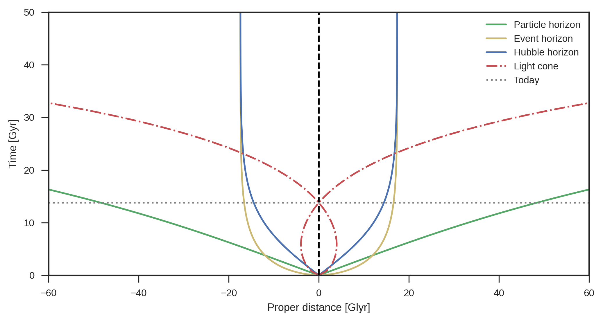

## Horizons in cosmology

An Horizon is a virtual region from which no information can travel. The most familiar exemple is given by the event horizons of black holes, from which not even light can espace (if you want to know more on them, go check [Black holes]()).

However, black holes are not the only objects to display such a feature ... the whole universe is! Intuitively, the Hubble-Lemaître law ($v = H_0d$) implies that the speed at which objects are pulled away from us due to expansion increase with their distance. One can then naturally ask the question : what happens when this speed becomes greater than the speed of light? In some sense, this horizon, works like a 'reversed black hole'. We'll come back to this ...

In this situation, we talk about cosmological horizons, and they can be of different kind.

One of the building principles of cosmology is to assume that the universe is homogeneous and isotropic on large scales. From this assumption, one can find the metric i.e. the way to measure distance in a given frame, satisfying the Einstein's equation for the universe.
The most general result is given by the *Friedman-Lemaître-Robertson-Walker (FLRW) metric*:

$$ 
ds^2 = -dt^2 + a(t)^2\left( \frac{dr^2}{1 - kr^2}  + r^2d\Omega^2\right) 
$$

In a frame called the comoving frame $(t,r,\theta,\varphi)$ expanding with the expansion. $d\Omega^2 = r^2\sin\theta^2 d\varphi^2$ is the spherical infinetisimal surface element. $a(t)$ is called the *scale factor* and quantify the expansion of the universe and of the coordinate system (i.e. objects always keep the same comoving coordinates but the physical distance between them evolves with $a(t)$.)). $k$ is the *spatial curvature* of the universe.
For practical purposes, the whole metric can be rewritten as:

$$ 
ds^2 = -c^2dt^2 + a(t)^2\left(d\chi^2 + S_k^2(r) d\Omega^2\right), 
$$

where

$$ 
S_k(r) =R_0 \left\{\begin{matrix}\frac{\chi}{R_0} \text{ if } k = 0\\
                 \sin\left(\frac{\chi}{R_0}\right) \text{ if } k = 1\\
                  \sinh\left(\frac{\chi}{R_0}\right) \text{ if } k = -1\\
            \end{matrix}\right. 
$$

$\chi$ is called the *comoving distance*. One can then recover the physical space distance $\ell$ by integration of $d\ell = \sqrt{a^2(t)d\chi^2 + S_k^2(r) d\Omega^2} $.
If $k=0$ then $\chi = r$. 

Using this metric, we will be able to define three different types of horizons on cosmological scales: the Hubble, particle and even horizons. Understanding the difference between them is quite subtle, hang on!

## The Hubble Horizon

The *Hubble Horizon* is the most known and easily understandable type cosmological horizon. It is actually the one we discussed in introduction, describing the distance at which galaxies recessed at the speed of light. To every point of the universe one can associate a surface, also called the *Hubble sphere*, delimited by this horizon. Beyond this horizon, it is de facto impossible to receive any signal and thus observe any galaxy. In a sense, it defines the size of what is commonly called the *observable universe*.

As we discussed already, the physical distance from the origin (say earth) to a galaxy is given by:

$$ 
d = a(t)\chi 
$$

The recession velocity is given by its time derivative (which gives us  the Hubble-Lemaître law)

$$ 
v = \frac{\text{d}d}{\mathrm{dt}} = \dot{a}\chi = aH\chi
$$

From this, we deduce that the velocity reaches $v = c$ at the distance of:

$$ 
d_H(t) = a(t)\chi = \frac{c}{H}
$$

This defines the radius of the Hubble sphere around earth.

## Particle horizon

The particle horizon around a given point is the surface answering the question:  What is the maximum distance of the object that emits light that we can still receive today despite the expansion? 

Before understanding what we really means, let's first cover how to calculate the distance travelled by light.

The maximal speed at which information can be carried is the speed of light. By definition, light has the physical speed $c = d\ell/dt$ (This condition is equivalent to ask for $ds^2=0$).

Choosing our coordinate system such that the photons only travel on the radial coordinate, this allows us to write:
$$ 
cdt = \pm a(t) d\chi 
$$
(the two solutions comes from the square root) and the co-moving distance $\chi$ between a source that the photon leave at $t_0$ and an observer that receive it at $t_1$ is given by:
$$ 
\chi = c \int_{t_0}^{t_1} \frac{dt}{a(t)} 
$$

If a photon is emitted at primordial singularity, $t = 0$ the maximal distance it has been able to travel is:

$$
\chi_p(t) = c \int_{0}^{t} \frac{dt'}{a(t')} 
$$

This distance is sometimes the called *conformal time* $\eta$

In terms of proper distance we can write

$$ 
d_p(t) = a(t)\chi_p(t)
$$

Which gives us the radius of the particle horizon.

## Event horizon

The event horizon answer to the question : If we send a photon today what is the maximum distance it can reach until the end of the Universe?

It's pretty same as for the particle horizon but this time we emitting the photon today $t_0$ and we let it travel until $t_f = +\infty$

$$ 
\chi_{evt}(t) = c\int_{t}^{+\infty} \frac{dt'}{a(t')} 
$$

In proper distance it is

$$
d_{evt}(t) = a(t)\chi_{evt}(t)
$$

Note that as we cannot reach something behind the event horizon, we cannot see what is emitted today behind it.

Another remark is that the event horizon can diverge and be infinite.

## The $\Lambda$CMD case 
Take the example of the $\Lambda$CDM cosmology using Planck parameters.

    
  
We can give a value for today horizons : in present time the particle is at ~ 48 Glyrs, the event horizon is at ~ 17 Glyrs and the Hubble horizon is at ~ 14 Glyrs.

Looking at the particle horizon we can see that due to expansion it's distance increase rapdily, it means that the farthest light we can see was emits by objects that are today at 48 Glyrs of us ! In our expansing universe the particle univers will tend to infinity.

Another remark is that the event horizon is greater than the Hubble distance : photons that lie between the two are currently receeding at supra-light speed but we will finally saw them as they will enter in the Hubble horizon ! 

We can prove that the Hubble horizon and the event horizon converge to the same limit :
the Friedmann equations give us 

$$
\frac{\dot{a}}{a} = H(a) = \sqrt{\Omega_m a^{-3} + \Omega_\Lambda}
$$

Then when $a \rightarrow +\infty$ we have $H \rightarrow \sqrt{\Omega_\Lambda}$

We can solve the differential equation of $a(t)$ in the limit when $t \rightarrow +\infty$ :

$$
a(t) = e^{\sqrt{\Omega_\Lambda} t}
$$

With this solution for $a(t)$ we can compute the limit of the event horizon :

$$
d_{evt} \sim a(t) c\int_t^{+\infty} e^{-\sqrt{\Omega_\Lambda} t}
$$

That give us :

$$ 
d_{evt} \sim a(t) \frac{1}{a(t) \sqrt{\Omega_\Lambda}} = \frac{c}{H} 
$$

That is the definition of the Hubble radius !

Something that can be strange is that our future light-cone seems to cross the envent horizon : How can it be possible we can interact with what is beyond? What we have to remember is that if we emit a photon now it will never reach someone that is at the event horizon now, but the proper distance of the object at the event horizon will evolve during the photon travel and the photon will never reach it!
