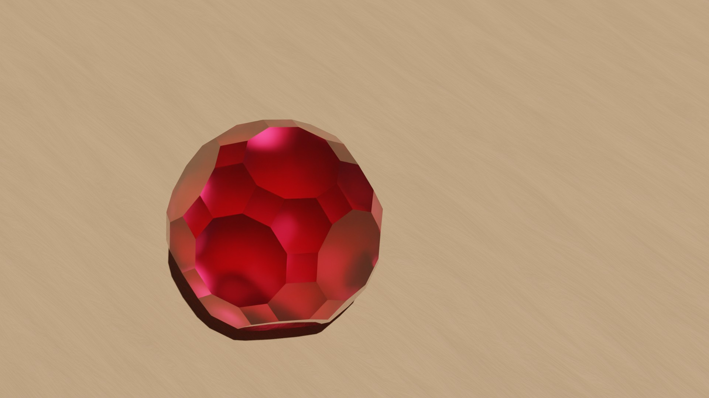

# Approche historique du théorème d'Euler sur les polyèdres

**En cours d'écriture, de nombreuses erreurs subsistent**

**En cours d'écriture, de nombreuses erreurs subsistent**

**En cours d'écriture, de nombreuses erreurs subsistent**

## Introduction

### *Les polyèdres*

> Figure XXX : Polyèdres réguliers et semi-réguliers

Le concept de polyèdre pour les mathématiciens du 18ème siècle était vaguement défini et reposait surtout sur une intuition forte de ces solides. Sur la figure, on peut observer des polyèdres qui font concensus, les solides de Platon qui sont des polyèdres réguliers et des solides d'Archimède. Quels sont leurs propriétés communes qui pourrait nous donner une première définition de polyèdre. Naïvement, ce sont des solides à face plane et c'est ainsi qu'il sont considéré par **de nombreux mathématiens** sans remarquer les postulats sous-jacent. Il faut commencer quelque part et c'est avec cette définition que nous commencerons, elle se montrera insuffisante et on peut déjà la mettre en conflit face à des exemples que nous rencontrerons durant ce périple.

> Figure XXX : Solides et surfaces polyèdrales hétérodoxes

C'est justement le travail de démonstration sur les polyèdres, en particuliers du théorème d'Euler, qui va venir consolider ce champs de recherche et mettre au grand jour les difficultés à saisir le sens de polyèdre. Et de cette question toute simple, peut on trouver une relation entre le nombre de face d'un polyèdre, son nombre de sommet et son nombre d'arête.

### *Le théorème d'Euler*

C'est en 1750 qu'Euler, dans une lettre à Golbach, énonce le théorème qui porte son nom. Descartes était passé de peu à côté [[1]](#1), Euler pointe son importance parmis une série de conjecture sur les polyèdres.

Pour tout polyèdre, son nombre de face $H$ auquelle on ajoute ses angles solides $S$ [^sommet] est égale à son nombre d'arête $A$ plus deux.

$$H+S=A+2$$

Vérifions cette équation sur certains exemples, et peut être souhaitez vous en chercher des contre-exemples.

| Polyèdre                | Nb de Sommet | Nb d'Arête | Nb de Face | S-A+H |
| ----------------------- | ------------ | ---------- | ---------- | ----- |
| Octaèdre                | 6            | 12         | 8          | 2     |
| Dodécaèdre              | 20           | 30         | 12         | 2     |
| Cuboctaèdre             | 12           | 24         | 14         | 2     |
| Icosidodécaèdre tronqué | 120          | 180        | 62         | 2     |

> Figure XXX : Icosidodécaèdre tronqué

Dans cette lettre, Euler introduit le terme d'arête, ce nouveau concept modifie la réflexion autour des polyèdres. On peut alors se demander si ce n'est pas le concept qui manquait pour découvrir cette relation. 

Euler en donnera une preuve 8 ans plus tard, Legendre, L'Huilier et Cauchy suivront peu après.

C'est les répercutions de ce théorème sur les mathématiciens francophones que nous allons analyser, comment les nombreuses preuves à paraître vont venir enrichir le débat, tout autant que des contres exemples. 

## La preuve de Legendre par projection sur une sphère 

En 1794, Legendre sort ses Éléments de géométrie, ces ouvrages se veulent une actualisation et une simplification des éléments d'Euclide. La preuve du théorème d'Euler n'y est pas centrale et semble être un petit détour que Legendre prend. Citons Lebesgue à propos de cette preuve :

> Legendre ne s'est jamais proposé de démontrer le théorème d'Euler, mais ayant bâti à une occasion quelconque des considérations voisines de celles qui figurent dans sa démonstration, il s'est aperçu qu'il avait les éléments nécessaires à cette démonstration. 

C'est dans son chapitre sur la géométrie sur la sphère que la démonstration prend place, l'astuce est de projeter le polyèdre sur une sphère pour utiliser les théorèmes développés précédement par Legendre. Une retranscription de la preuve est disponible en vidéo ci-dessous.

Quelques définitions sont nécessaire pour appréhender la preuve :

1. On appelle *grand cercle* la section de la sphère faite par un plan passant par sont centre. Ce plan coupe en deux surfaces égales la sphère.
2. *Fuseau* est la partie de la surface de la sphère comprise entre deux demi-grands cercle qui se terminent à un diamètre commun.
3. *Triangle sphérique* est une partie de la surface de la sphère comprise par trois arcs de grands cercles. Ces arcs, qui sont les côtés du triangle, sont toujours supposés plus petits que la demi-circonférence.

L'unité d'angle est l'angle droit et l'untité de surface est le triangle tri-rectangle sur la sphere (1/8 ème de la sphère).

<video width="100%" controls>
	<source src="media/legendre.mp4" type="video/mp4">
</video>

Dans le chapitre sur les polyèdres précédent celui sur la sphère, Legendre nous donne sa définition des polyèdres :

> On appelle *solide polyèdre*, ou simplement *polyèdre*, tout solide terminé par des plans ou des faces planes. (Ces plans sont nécessairement terminés eux-mêmes par des lignes droites.) 

À propos des arêtes :

> L'intersection commune de deux faces adjacentes d'un polyèdre s'appelle côté ou arête du polyèdre

Puis en bas de page, il y a cette note très importante :

> N. B. Tous les polyèdres que nous considérons sont des polyèdres à angles saillants ou polyèdres convexes. Nous appelons ainsi ceux dont la surface ne peut être rencontrée par uen linge droite en plus de deux points. Dans ces sortes de polyèdres le plan prolongé d'une face ne peut couper le solide ; il est donc impossible que le polyèdre soit en partie au-dessus du plan d'uen face, en partie au-dessous; il est tout entier d'un même côté de ce plan.

Legendre se replie sur le terrain sûr celui des polyèdres convexes, il ne souhaite donc pas pouvrer la conjecture d'Euler dans toute sa généralité (sur tout polyèdre). Il évite ainsi les questions difficiles de la conjecture, qui est la classification des solides non convexes.

Poinsot en 1810 remarquera que la preuve de Legendre peut s'appliquer à une classe plus grande de polyèdres :

> Je ferai d'abord observer que l'équation précédente n'a pas seulement lieu pour les solides convexes ordinaires, c'est-à-dire, pour ceux dont la surface ne peut être coupée par une droite en plus de deux points elle subsiste encore pour tout polyèdre qui a des angles solides rentrans pourvu qu'on puisse trouver, dans l'intérieur du solide un point qui soit le centre d'une sphère telle que les faces du solide y étant projetées par des lignes menées au centre, il n'y ait sur la sphère aucune duplicature de ces projections je veux dire, pourvu qu'aucune face ne se projette, en tout ou en partie, sur la projection d'une autre; ce qui convient, comme on voit, à une infinité de polyèdres à angles solides rentrans.

On peut aussi noté que c'est une preuve géométrique qui ne s'écarte pas des concepts métriques contrairement à ce qu'avais essayé Euler et c'est aussi dans ce sens que sera la preuve de Cauchy. On remarque alors sont utilisation des unité et il peut être étonnant de que certaine de ses équations sont une égalité entre des angles et des aires. par exemple $aire(ABC)=\sum_{i=1}^{3}\tau_i-2$ avec $\tau_i$ l'angle i du triangle. On peut faire sens cette équation en ce ramenant à l'égalité entre proportion sur le fuseau d'une sphère :

$$\frac{aire(Fuseau)}{aire(Sphere)}=\frac{angle(Fuseau)}{4\ angles\ droits} \Leftrightarrow \frac{aire(Fuseau)}{8}=\frac{angle(Fuseau)}{4} \Leftrightarrow \frac{aire(Fuseau)}{2}=angle(Fuseau)$$

On peut alors penser un angle comme une aire à l'aide cette égalité.

Le mathématicien suivant qui nous intéresse a justement développé sa classification des polyèdres sur la technique de démonstration de Legendre. En applicant sa méthode, Poissot va aussi (re)découvrir des polyèdres étoilés qui seront un carburant pour une pensée plus globale de ce champs.

## Poissot et la classification des polyèdres

C'est dans le journal de l'école polytechnique de 1810 que Poissot présente sa réflexion sur la question des polyèdre. Dans son introduction il place sa réflexion dans un champs de recherche bien précis des mathématiques qui est celui de la géométrie de situation :

> On rapporte les questions suivantes à la géométrie de situation parce qu'on y considère moins la grandeur et la proportion des figures, que l'ordre et la situation des divers élémens qui les composent.

Il fait aussi état du peu de travaux dans cette branche, il semble donc mettre en avant l'aspect novateur de la question qui l'occupe, d'où le fait d'utiliser des outils de géométrie pour traiter cette branche naissante.

Avant de traiter la classification des polyèdres, il va traiter la classification des polygones, une question plus simple, amenant de bonnes idées pour le traitement des polyèdres, en particuliers la questions des polygones étoilés. Combient existe il de polygones à 5 côtés égaux ?

géométrie de situation def, lien analisis situs et topologie. 

def polygone, convexité des polygones, classification des polygones (somme des angles et nb de côtés)

justification des polygones étoilés (p.26)

limite des 5 polyèdres réguliers, sujection de la preuve pour la convexité (p.34)
mot sommet, Notion de minimum de faces. def face, arête, sommet.

Solide. Projection sur la sphère (par.29) nombre de recouvrement.

Notion de "Contre exemple" non introduite

## L'Huilier une classification des contres exemples
## Cauchy projette sur le plan les polyèdres
## References
<a id="1">[1]</a>  Ref 1 test

***Pour aller plus loin***

David S. Richeson, Eulers gem - the polyhedron formula and the birth of topology (2008)

Norman L. Biggs, E. Keith Lloyd, R. J. Wilson - Graph Theory 1736-1936 

Peter R. Cromwell - Polyhedra (1999)

Imre Lakatos - Preuves et Réfutations essai sur la logique de la découverte mathématique

Jean-Claude Pont - La topologie algébrique des origines à Poincaré

***Sources Primaires***

L. Euler,

> 1758 'Elementa Doctrinae Solidorum', Novi Commentarii Academiae Scientiiuuni Petropolitanae 4 (1752/53) ppl09-140 427

> (1758b). Elementa doctrinae solidorum. Novi Commentarii Academiae Sci- entiarum Petropolitanae 4, 72–93. Reprinted in Opera Omnia series 1, vol. 26, 71–93.

> 1758 'Demonstratio Nonnullarum Insignium Proprietatum Quibus Solida Hedris Planis Inclusa Sunt Praedita', Novi Commentarii Academiae Scientiarum Petropolitanae 4 (1752/53) ppl40-160

>  (1758a). Demonstratio nonnullarum insignium proprietatum quibus solida hedris planis inclusa sunt praedita. Novi Commentarii Academiae Scientiarum Petropolitanae 4, 94–108. Reprinted in Opera Omnia series 1, vol. 26, 94–108.

> Solutio problematis ad geometriam situs pertinentis. Commentarii Academiae Scientiarum Imperialis Petropolitanae 8, 128–40. Reprinted in Opera Omnia series 1, vol. 7, 1–10.

> Euler Archive, http://www.eulerarchive.org.

A. M. Legendre,

> 1794 Elements de Geometrie, def p.163, proof p.226, note p.307, Paris ((Euler))

L. Poinsot,

> 1810 'Memoire sur les Polygones et les Polyedres', J. Ecoie Polytechnique 10 (1810) ppl6-48 ((Euler,Legendre))

S. A. J. L'Huilier,

> 1811 'Demonstration Immediate d'un Theoreme Fondamental d'Euler sur les Polyhedres, et Exceptions dont ce Theoreme est Susceptible', Memoires de VAcademie Imperiale de Saint Petersbourg 4 (1811) pp271-301 ((Euler,Legendre))

> 1812 'Memoire sur la Polyedrometrie', Annales de Math., Pures et Appliquees 3 (1812/13) ppl68-191 428 Bibliography 

> 1812 'Memoire sur les Solides Reguliers', Annales de Math., Pures et Appliquees 3 (1812/13) pp233-237 

A. L. Cauchy,

> 1813 'Recherches sur les Polyedres (first memoire, part 2)', J. Ecolc Polytochnique 9 (1813) pp68-86 ((Euler,Legendre,poinsot))

> 1813 'Sur les Polygones et Polyedres (second memoire)', J. Ecole Polytechnique 9 (1813) pp87-98 

***Notes de bas de page***

[^sommet]: Un angle solide est ici un synonyme de sommet.