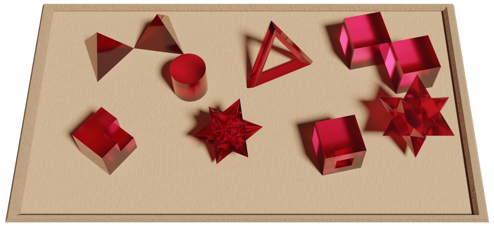
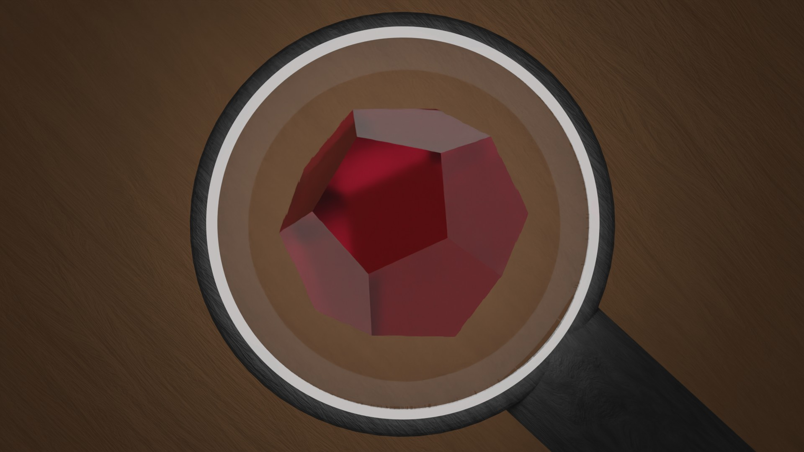

# Approche historique du théorème d'Euler sur les polyèdres

[TOC]

## Introduction

### *Les polyèdres*

Le concept de polyèdre qui paraît intuitif à tous, va se montrer très vaguement défini sur la période étudiée ici. C'est justement le travail de démonstration sur les polyèdres, en particuliers du théorème d'Euler, qui va mettre le problème au premier plan. 

> Figure XXX

Sur la figure, on peut observer des polyèdres qui font concensus, les solides de Platon qui sont des polyèdres réguliers et des solides d'Archimède. Quels sont leurs propriétés communes qui pourrait nous donner une première définition de polyèdre. Naïvement, ce sont des solides à faces planes polygonales, avec pour définition d'un polygone une figure géométrique plane formée d'une ligne brisée fermée. Il faut commencer quelque part et c'est avec ces définitions que nous commencerons, elles se montreront insuffisantes et on peut déjà la mettre en conflit face à des exemples que nous rencontrerons durant ce périple.

>Figure XXX

Revenons sur le terrains moins glissant des exemples de la figure XXX, peut on trouver une relation entre le nombre de face d'un polyèdre, son nombre de sommet et son nombre d'arête.

### *Le théorème d'Euler*

C'est en 1750 qu'Euler, dans une lettre à Golbach, énonce le théorème qui porte son nom. Descartes était passé de peu à côté [[1]](#1), Euler pointe son importance parmis une série de conjecture sur les polyèdres.

Pour tout polyèdre, son nombre de face $H$ auquelle on ajoute ses angles solides $S$ [[a]](#a) est égale à son nombre d'arête $A$ plus deux.

$$H+S=A+2$$

| Polyèdre                | Nb de Sommet | Nb d'Arête | Nb de Face | S-A+H |
| ----------------------- | ------------ | ---------- | ---------- | ----- |
| Octaèdre                | 6            | 12         | 8          | 2     |
| Dodécaèdre              | 20           | 30         | 12         | 2     |
| Cuboctaèdre             | 12           | 24         | 14         | 2     |
| Icosidodécaèdre tronqué | 120          | 180        | 62         | 2     |

> Figure XXX

Dans cette lettre, Euler introduit le terme d'arête, ce nouveau concept modifie la réflexion autour des polyèdres. On peut alors se demander si ce n'est pas le concept qui manquait pour découvrir cette relation. 

Euler en donnera une preuve 8 ans plus tard, Legendre, L'Huilier et Cauchy suivront peu après.

C'est les répercutions de ce théorème sur les mathématiciens francophones que nous allons analyser, comment les nombreuses preuves à paraître vont venir enrichir le débat, tout autant que des contres exemples. 

## La preuve de Legendre par projection sur une sphère 

En 1794, Legendre sort ses Éléments de géométrie, ces ouvrages se veulent une actualisation et une simplification des éléments d'Euclide. La preuve du théorème d'Euler n'y est pas centrale et semble être un petit détour que Legendre prend. Citons Lebesgue à propos de cette preuve :

> Legendre ne s'est jamais proposé de démontrer le théorème d'Euler, mais ayant bâti à une occasion quelconque des considérations voisines de celles qui figurent dans sa démonstration, il s'est aperçu qu'il avait les éléments nécessaires à cette démonstration. 

C'est dans son chapitre sur la géométrie sur la sphère que la démonstration prend place, l'astuce est de projeter le polyèdre sur une sphère pour utiliser les théorèmes développés précédement par Legendre. Une retranscription de la preuve est disponible en vidéo ci-dessous.

<video controls>

  <source src="media/legendre.mp4" type="video/mp4">

Your browser does not support the video tag.

</video>

## Poissot et la classification des polyèdres
## L'Huilier une classification des contres exemples
## Cauchy projette sur le plan les polyèdres
## References
<a id="1">[1]</a>  Ref 1 test

<a id="a">[a]</a>